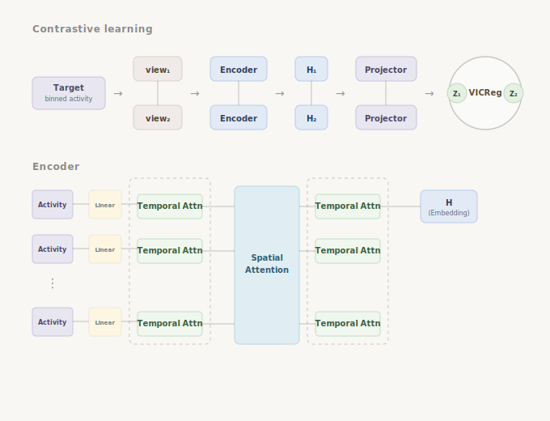

# Extracting Invariant Information from Multidimensional Time-Series Data via Spatio-Temporal Transformer and Contrastive Learning

A self-supervised framework for learning **time-invariant, intrinsic representations** of neurons from population neural activity. The model uses a transformer over binned spike trains with **spatial context**: the target neuron is always first, surrounded by its nearest neighbors ordered by distance, with **distance-tokenized positional encoding** in the spatial attention. Training is contrastive (same neuron, two time windows) with **VICReg**; at inference you get a single embedding vector per neuron for downstream tasks.

---

## Overview

- **Input:** Binned population activity in a time window + neuron coordinates (to order neighbors by distance).
- **Architecture:** Patch projection → **temporal transformer** (rotary position encoding) → **spatio-temporal transformer** (spatial self-attention with distance-based positional encoding, then temporal again) → mean pooling over time → **target-neuron embedding** (index 0 only).
- **Training:** Two views per batch (two time windows for the same set of neurons). Encoder outputs embeddings; a projector head maps them for **VICReg** (invariance + variance + covariance). No labels required.
- **Inference:** Encoder only (no projector). One embedding vector per (window, target neuron); optionally average over multiple windows per neuron.
- **Downstream:** Use embeddings as features for classification (e.g. cell type, brain region), clustering, or retrieval.



---

## Spatial ordering and position encoding

- For each window we form a set of **n** neurons: **target** (index 0) + **n−1 nearest neighbors** by Euclidean distance.
- Neighbors are ordered by **distance to the target** (closest first).
- In the spatial block, we add a **tokenized distance embedding**: the target gets a dedicated embedding (e.g. id 0); each neighbor gets an embedding from a small table indexed by discretized distance to the target (e.g. K bins). This makes the model aware of who is the target and how far the context neurons are.

---

## Installation

```bash
cd Invariant-learning
pip install -r requirements.txt
```

Requirements: `torch`, `numpy`, `einops`, `pyyaml`, `scikit-learn`.

---

## Project layout

```
Invariant-learning/
├── configs/
│   └── default.yaml       # Model and training hyperparameters
├── src/
│   ├── nn/                 # Rotary and spatial pos embeddings, attention
│   ├── models/             # Encoder, projector, VICReg
│   ├── training/           # Training loop (two-view, VICReg)
│   └── evaluation/        # Embedding extraction and downstream classification
├── requirements.txt
└── README.md
```

---

## Usage

### 1. Data contract

Your data pipeline should produce:

- **Bins:** `(B, n, P, bins_per_patch)` — for each of **B** samples, **n** neurons (target + n−1 neighbors), **P** time patches, each patch of size `bins_per_patch`.
- **Distance bin ids:** `(B, n)` — integer indices: `0` for the target, `1 .. K` for neighbors (from discretized distance to target), used for spatial positional embedding.

Batching: for training, assume **aligned two-view batches**: `view1[i]` and `view2[i]` correspond to the same neuron (two different time windows). The training script uses `match_idx = (arange(B), arange(B))`.

### 2. Training

```python
import torch
from src.models import NeuronEncoder, VICReg
from src.training.train import run_training, load_config

config = load_config("configs/default.yaml")
device = torch.device("cuda" if torch.cuda.is_available() else "cpu")

encoder = NeuronEncoder(
    bins_per_patch=config["model"]["bins_per_patch"],
    dim=config["model"]["dim"],
    num_heads=config["model"]["num_heads"],
    dim_head=config["model"]["dim_head"],
    t_layers=config["model"]["t_layers"],
    st_layers=config["model"]["st_layers"],
    num_latents=config["model"]["num_latents"],
    num_distance_bins=config["model"]["num_distance_bins"],
    attn_dropout=config["model"]["attn_dropout"],
    ff_dropout=config["model"]["ff_dropout"],
).to(device)

vicreg = VICReg(
    dim_in=config["model"]["dim"],
    inv_factor=config["vicreg"]["inv_factor"],
    var_factor=config["vicreg"]["var_factor"],
    cov_factor=config["vicreg"]["cov_factor"],
    var_cutoff=config["vicreg"]["var_cutoff"],
    use_projector=config["vicreg"]["use_projector"],
).to(device)

# train_loader yields (view1_bins, view1_dist_ids, view2_bins, view2_dist_ids)
run_training(encoder, vicreg, train_loader, config, device, checkpoint_dir=Path("checkpoints"))
```

### 3. Inference (embeddings)

```python
from src.evaluation.embed import extract_embeddings

# bins: (B, n, P, bins_per_patch), distance_bin_ids: (B, n)
H = extract_embeddings(encoder, bins, distance_bin_ids, device, aggregate="none")
# H shape: (B, dim). For multiple windows per neuron, stack then use aggregate="mean" per neuron.
```

### 4. Downstream classification

```python
from src.evaluation.downstream import run_downstream_classification
import numpy as np

# H: (N, dim), labels: (N,) e.g. cell type or region
X = np.asarray(H)
y = np.asarray(labels)
result = run_downstream_classification(X, y, n_splits=5, classifier="mlp")
print(result["mean_metrics"])  # precision, recall, f1
```

---

## Configuration

Edit `configs/default.yaml` to set:

- **Model:** `bins_per_patch`, `dim`, `num_heads`, `t_layers`, `st_layers`, `num_latents`, `num_distance_bins`, dropout.
- **VICReg:** `inv_factor`, `var_factor`, `cov_factor`, `var_cutoff`, `use_projector`.
- **Training:** `batch_size`, `num_epochs`, `lr`, `weight_decay`, `warmup_ratio`, `grad_clip`.

---

## Design choices

| Component | Choice |
|----------|--------|
| **Temporal structure** | Rotary position encoding on patch index (relative time). |
| **Spatial structure** | Target first, then neighbors by distance; distance discretized into bins and embedded. |
| **Loss** | VICReg (invariance between paired views, variance and covariance regularization). |
| **Output** | Only the embedding of the target neuron (index 0); neighbors provide context. |

---

## Citation

If you use this code or the NeurPIR framework in your work, please cite:

**Wu, W., Liao, C., Deng, Z., Guo, Z., & Wang, J.** (2025). Neuron Platonic Intrinsic Representation From Dynamics Using Contrastive Learning. In *The Thirteenth International Conference on Learning Representations (ICLR 2025)*. [https://arxiv.org/abs/2502.10425](https://arxiv.org/abs/2502.10425)

```bibtex
@inproceedings{wu2025neurpir,
  title     = {Neuron Platonic Intrinsic Representation From Dynamics Using Contrastive Learning},
  author    = {Wu, Wei and Liao, Can and Deng, Zizhen and Guo, Zhengrui and Wang, Jinzhuo},
  booktitle = {The Thirteenth International Conference on Learning Representations (ICLR)},
  year      = {2025},
  url       = {https://arxiv.org/abs/2502.10425}
}
```

---

## License

Use and modify as needed for your research. If you use this code in a paper, please cite the repository and the paper above.
